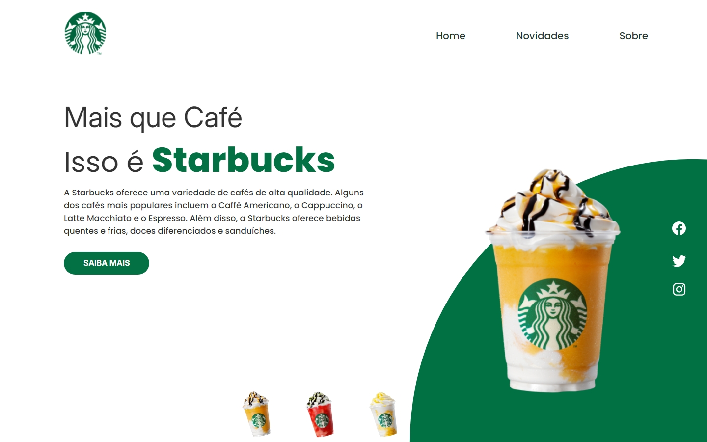
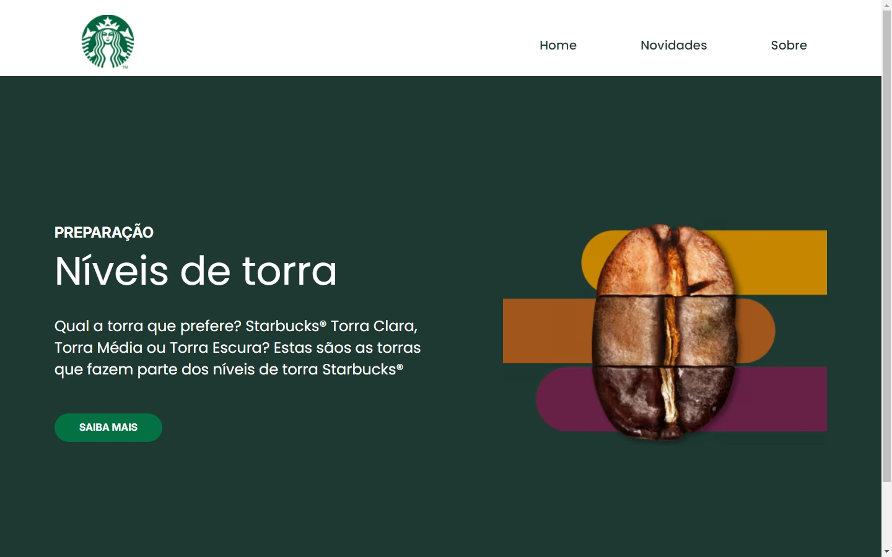
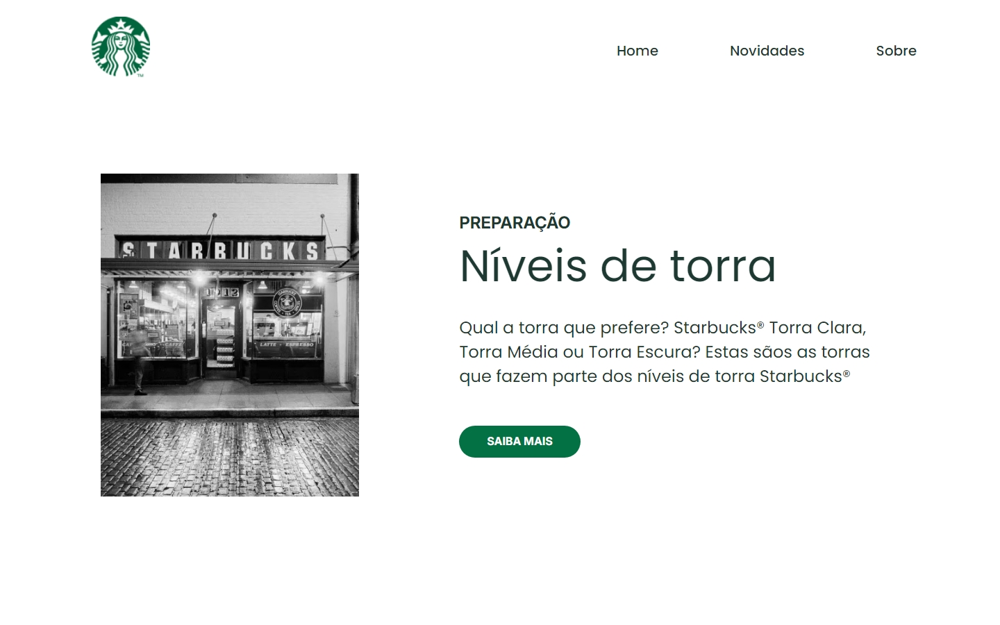

# ☕ Landing Page Starbucks

<div align="center">
  
  
  
  
  
</div>

## 📋 Sobre o Projeto

Este projeto foi desenvolvido como um desafio final de módulo, com o objetivo de criar uma landing page interativa e responsiva para a Starbucks. O foco principal foi aplicar conceitos fundamentais de React e boas práticas de desenvolvimento front-end, resultando em uma interface moderna e funcional.

## 📸 Screenshots

### Página Inicial
<div align="center">
  
  <p><em>Página inicial com o tema verde clássico Starbucks</em></p>
</div>


### Seção de Novidades
<div align="center">
  
  <p><em>Página de Novidades apresentando os níveis de torra</em></p>
</div>

### Seção Sobre
<div align="center">
  
  <p><em>Página Sobre com informações da loja</em></p>
</div>


### 🎯 Objetivos do Projeto

- **Design Fiel**: Implementação precisa do design proposto
- **Código Semântico**: Utilização apropriada de tags HTML para melhor acessibilidade
- **Estilização Profissional**: Uso avançado de styled-components
- **Estrutura Organizada**: Componentização clara e bem definida

### ✨ Principais Características

#### Interface Interativa
- Mudança dinâmica de cores ao selecionar diferentes produtos
- Transições suaves entre elementos
- Animações responsivas para melhor engajamento

#### Organização do Código
- **Componentes Reutilizáveis**: Header, seções de conteúdo e elementos de UI
- **Styled Components Estruturados**: Mixins e estilos globais bem definidos
- **Nomenclatura Clara**: Componentes e estilos com nomes descritivos e intuitivos

#### Design Responsivo
- Layout adaptativo para diferentes tamanhos de tela
- Experiência consistente em dispositivos móveis e desktop
- Transições suaves entre diferentes visualizações

### 🎨 Funcionalidades de Destaque

1. **Página Inicial Dinâmica**
   - Seletor interativo de produtos com mudança de tema
   - Círculo de fundo com transição de cores
   - Informações destacadas sobre a marca

2. **Seção de Novidades**
   - Apresentação dos níveis de torra de café
   - Layout informativo com imagens e descrições
   - Botões de call-to-action estrategicamente posicionados

3. **Área Sobre**
   - Showcase da loja física
   - Informações institucionais
   - Design clean e profissional

## 🛠️ Tecnologias Utilizadas

- **React.js**: Biblioteca frontend para construção de interfaces
- **Styled Components**: Solução de estilização CSS-in-JS
- **React Router DOM**: Gerenciamento de rotas
- **React Hooks**: Gerenciamento de estado (useState)

## 🚀 Começando

### Pré-requisitos

- Node.js (versão 14 ou superior)
- npm ou yarn

### Instalação

1. Clone o repositório
```bash
git clone https://github.com/edimaiquemaciel/DesafioFinal.git
```

2. Entre no diretório do projeto
```bash
cd landing-page-starbucks
```

3. Instale as dependências
```bash
npm install
# ou
yarn install
```

4. Inicie o servidor de desenvolvimento
```bash
npm start
# ou
yarn start
```

## 📁 Estrutura do Projeto

```
landing-page-starbucks/
├── src/
│   ├── assets/         # Imagens e arquivos estáticos
│   ├── components/     # Componentes React
│   │   ├── Header/    # Componente do cabeçalho
│   │   ├── Home/      # Página inicial
│   │   ├── Novidades/ # Seção de novidades
│   │   └── Sobre/     # Página sobre
│   ├── Style.js       # Styled components e estilos globais
│   └── App.js         # Componente principal da aplicação
├── public/
└── package.json
```

## 🎯 Detalhamento das Funcionalidades

### Página Inicial
- Display interativo de copos com temas de cores mutáveis
- Transições dinâmicas de background
- Informações envolventes sobre produtos

### Seção de Novidades
- Informações sobre preparação de café
- Explicação sobre níveis de torra
- Botões de chamada para ação

### Seção Sobre
- Informações sobre a empresa
- Showcase da loja
- Detalhes adicionais sobre produtos

## 💅 Estilização

O projeto utiliza styled-components com:
- Mixins personalizados para layouts consistentes
- Estilos globais para tipografia e reset
- Princípios de design responsivo
- Transições dinâmicas de tema

## 🤝 Como Contribuir

1. Faça um Fork do projeto
2. Crie sua Feature Branch (`git checkout -b feature/NovaFuncionalidade`)
3. Faça commit das suas alterações (`git commit -m 'Adiciona nova funcionalidade'`)
4. Faça Push para a Branch (`git push origin feature/NovaFuncionalidade`)
5. Abra um Pull Request

## 📄 Licença

Este projeto está sob a licença MIT - veja o arquivo [LICENSE.md](LICENSE.md) para mais detalhes

## 📞 Contato

  Edimaique Maciel - [edimaiqueacacio@gmail.com](mailto:edimaiqueacacio@gmail.com)

Link do Projeto: (https://github.com/edimaiquemaciel/DesafioFinal)

---
